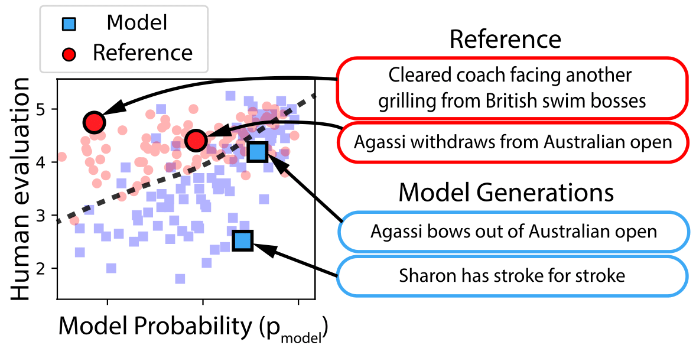

## HUSE &mdash; Human Unified with Statistical Evaluation

**Picture:** *INSERT STATEMENT HERE*

This repository contains the ready to use evaluation methodoly of the following paper:

> **Unifying Human and Statistical Evaluation for Natural Language Generation** 
> Tatsunori B. Hashimoto*, Hugh Zhang*, Percy Liang 
> *Equal contribution
>
> **Abstract:** *How can we measure whether a natural lan- guage generation system produces both high quality and diverse outputs? Human evalu- ation captures quality but not diversity, as it does not catch models that simply plagiarize from the training set. On the other hand, sta- tistical evaluation (i.e., perplexity) captures di- versity but not quality, as models that occa- sionally emit low quality samples would be in- sufficientlypenalized. Inthispaper,wepro- pose a unified framework which evaluates both diversity and quality, based on the optimal er- ror rate of predicting whether a sentence is human- or machine-generated. We demon- strate that this error rate can be efficiently es- timated by combining human and statistical evaluation, using an evaluation metric which we call HUSE. On summarization and chit- chat dialogue, we show that HUSE detects di- versity defects which fool pure human eval- uation and that techniques such as annealing for improving quality actually decrease HUSE due to decreases in diversity.*

An example is given with summarization_example.py

INSERT MORE DESCRIPTION